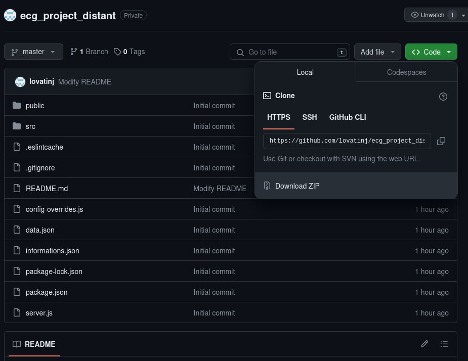

# Projet Ecg Distant

Ce projet est une application permettant aux médecins de surveiller les fréquences cardiaques de leurs clients et d'accéder à un historique détaillé de leurs données cardiovasculaires. Ce projet reçoit toutes les données depuis un broker MQTT TTN et les enregistre ensuite sur une base de données MongoDB cloud (Atlas).

Ce projet a été entièrement développé avec Node.js et React.js, ainsi que différentes bibliothèques telles que, par exemple, Material-UI pour l'interface graphique de l'application web.

Node.js doit être installé sur le système, ainsi que l'utilitaire npm.

## Installation

```bash
npm install
npm run build
```

## Usage

```bash
npm start
```

## Problèmes

Il est possible que vous rencontriez un problème lors de la compilation du projet :

```
Error: error:0308010C:digital envelope routines::unsupported
    ...
    at process.processTicksAndRejections (node:internal/process/task_queues:95:5) {
  opensslErrorStack: [ 'error:03000086:digital envelope routines::initialization error' ],
  library: 'digital envelope routines',
  reason: 'unsupported',
  code: 'ERR_OSSL_EVP_UNSUPPORTED'
}
Node.js v18.13.0
```

Pour corriger ce problème, qui provient de la version de Node.js installée, vous devez exporter une variable d'environnement :

```bash
export NODE_OPTIONS=--openssl-legacy-provider
```

## Télchargement

Si vous voulez télécharger l'application en format compresser vous avez seulement besoin de cliquer sur le bouton code puis de cliquer sur "Download ZIP" :

<p align="center">
  
</p>
